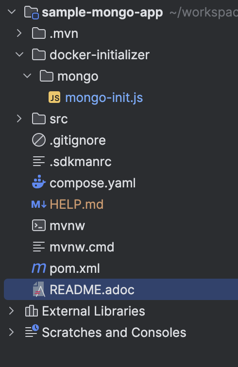
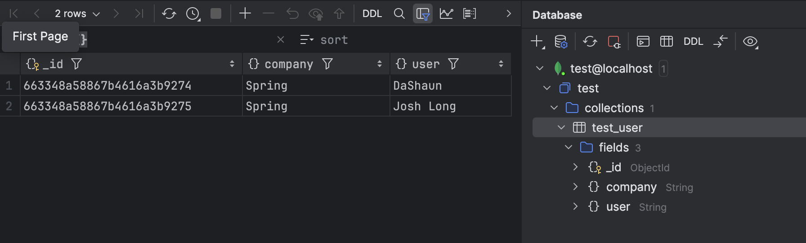

= SAMPLE SPRING APPLICATION WITH MONGO

The aim is to have a Spring application with docker-compose support, Mongo and which creates a collection with some data in it on container starts up.

== HOW

Adding a folder in root with `scripts` to initialize some containers in `compose.yml` file.

Configure the `volumes` section in container pointing to `scripts` folder

So, now the `compose.yaml` include this initialization

[source,yaml]
----
services:
  mongodb:
    image: 'mongo:latest'
    environment:
      - 'MONGO_INITDB_DATABASE=mydatabase'
      - 'MONGO_INITDB_ROOT_PASSWORD=secret'
      - 'MONGO_INITDB_ROOT_USERNAME=root'
    volumes:
      - ./docker-initializer/mongo/mongo-init.js:/docker-entrypoint-initdb.d/mongo-init.js:ro
    ports:
      - '27017'

----

As per documentation in Mongo, it will require '*.js' files in `/docker-entrypoint-initdb.d`

link:https://hub.docker.com/_/mongo[docker hub Mongo image]

in section:

`Initializing a fresh instance`

[source,text]
----
INITIALIZING A FRESH INSTANCE

When a container is started for the first time it will execute files with extensions .sh and .js that are found in /docker-entrypoint-initdb.d. Files will be executed in alphabetical order. .js files will be executed by mongosh (mongo on versions below 6) using the database specified by the MONGO_INITDB_DATABASE variable, if it is present, or test otherwise. You may also switch databases within the .js script.
----

An example of this data might be:

[source,js]
----
db = db.getSiblingDB('test');

db.createUser({
    user: "test",
    pwd: "test",
    roles: [{
        role: 'readWrite',
        db: 'test'
    }]
});

/*
Increase what you want to initialize when mongo starts up
 */

db.createCollection('test_user');

db.test_user.insertMany([
    {
        user: 'DaShaun',
        company: 'Spring'
    },
    {
        user: 'Josh Long',
        company: 'Spring'
    }
]);

----

As a result of it, when the container has started up, it contains:

== WHY

The reason is to have a set of data ready to play with and avoid coding a service which includes this data into database for other tests.

== ALTERNATIVES

- As a known alternative for it would be `mongock` with patches to incrementally create collections and data in those collections.

link:https://docs.mongock.io/[mongock]

- Create an `Spring Data Mongo Initializer` which loads content on files into the database, similar to

link:https://docs.spring.io/spring-boot/how-to/data-initialization.html#howto.data-initialization.using-basic-sql-scripts[Initialize a Database Using Basic SQL Scripts]
